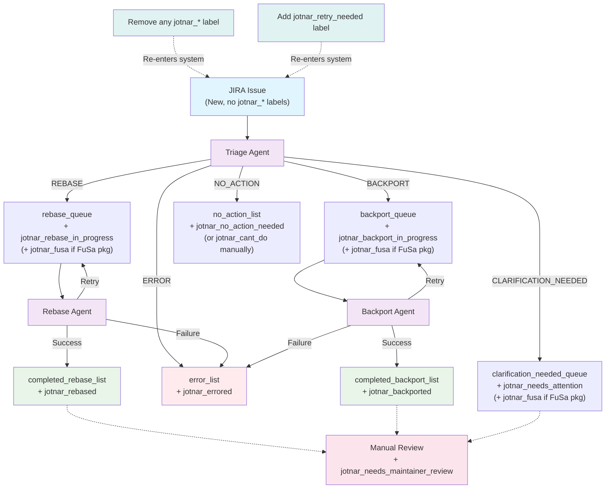

# Package Maintenance Workflows

A set of AI agents implemented in the BeeAI Framework, interconnected via Redis.
Every agent can run individually or pick up tasks from a Redis queue.

See [README.md](README.md) for general notes about setting up the development environment.

## Architecture

Three agents process tasks through Redis queues:
- **Triage Agent**: Analyzes JIRA issues and determines resolution path. It uses title, description, fields, and comments to find out root cause of the issue. It can ask for clarification, create tasks for other agents or may take no action if not needed.
- **Rebase Agent**: Updates packages to newer upstream versions. A Rebase is only to be chosen when the issue explicitly instructs you to "rebase" or "update". It looks for upstream references that are linked, attached and present in the description or comments in the issue.
- **Backport Agent**: Applies specific fixes/patches to packages. It looks for patches that are linked, attached and present in the description or comments in the issue. It tries to apply the patch and resolve any conflicts that may arise during the backport process.


## Dry run mode

**Without setting `DRY_RUN=true` env var, agents will make real changes:**
- **Modify JIRA issues** (add comments, update fields, apply labels)
- **Create GitLab merge requests** and push commits

## Setup

### Required API Tokens & Authentication

- Copy templates:

```bash
cp -r templates .secrets
```

- Follow the comments to fill out the needed credentials.

The `mcp-gateway` requires a `keytab` file.

Steps to generate a personal kerberos keytab file:

```
> kinit <REDHAT_KERBEROS_ID>@IPA.REDHAT.COM

> kvno krbtgt/IPA.REDHAT.COM@IPA.REDHAT.COM
krbtgt/IPA.REDHAT.COM@IPA.REDHAT.COM: kvno = 1 # Note `kvno` value for the next step

> ktutil
ktutil:  addent -password -p <REDHAT_KERBEROS_ID>@IPA.REDHAT.COM -k 1 -f
Password for <REDHAT_KERBEROS_ID>@IPA.REDHAT.COM:
ktutil:  wkt /tmp/keytab
ktutil:  q

> kinit -kt /tmp/keytab <REDHAT_KERBEROS_ID>@IPA.REDHAT.COM
```

If last command is successful, move `/tmp/keytab` file to `.secrets/keytab` and set permissions to `644` so the user inside the container can read it.

This file should be kept secure as it can be used as a replacement for password-less authentication and impersonate the user.

## Running the System

### Full Pipeline (Production)
```bash
# Start all agents and services
make start
# make start DRY_RUN=true for testing purposes

# Process a JIRA issue
make trigger-pipeline JIRA_ISSUE=RHEL-12345
```

### Individual Agents Runs
```bash
# Test specific agents standalone
make JIRA_ISSUE=RHEL-12345 run-triage-agent-standalone
make PACKAGE=httpd VERSION=2.4.62 JIRA_ISSUE=RHEL-12345 BRANCH=c10s run-rebase-agent-standalone
make PACKAGE=httpd UPSTREAM_FIX=https://github.com/... JIRA_ISSUE=RHEL-12345 BRANCH=c10s run-backport-agent-standalone

# Or with dry-run
DRY_RUN=true make JIRA_ISSUE=RHEL-12345 run-triage-agent-standalone
```

**Monitoring:**
- Phoenix tracing: http://localhost:6006/
- Redis queue monitoring: http://localhost:8081/

## How It Works

### Queue Transitions and Label Management

The system uses Redis queues to route issues between agents and applies JIRA labels to track progress:

**From Triage Agent:**
- **REBASE decision** → `rebase_queue` + applies `jotnar_rebase_in_progress` label
- **BACKPORT decision** → `backport_queue` + applies `jotnar_backport_in_progress` label
- **CLARIFICATION_NEEDED decision** → `clarification_needed_queue` + applies `jotnar_needs_attention` label
- **NO_ACTION decision** → `no_action_list` + applies `jotnar_no_action_needed` label (jötnar team members may apply `jotnar_cant_do` if the system cannot solve the problem)
- **ERROR/Exception** → `error_list` + applies `jotnar_errored` label
- **Max retries exceeded** → `error_list` + applies `jotnar_errored` label

**From Rebase Agent:**
- **Success** → `completed_rebase_list` + applies `jotnar_rebased` label
- **Failure** → `error_list` + applies `jotnar_errored` label
- **Retry** → remains in `rebase_queue` (keeps `jotnar_rebase|backport_in_progress` label)

**From Backport Agent:**
- **Success** → `completed_backport_list` + applies `jotnar_backported` label
- **Failure** → `error_list` + applies `jotnar_errored` label
- **Retry** → remains in `backport_queue` (keeps `jotnar_rebase|backport_in_progress` label)

### Service triggering

Jotnar bot processes issues assigned to `jotnar-project`.

Issues can be re-triggered through the workflow in two ways:
1. **Remove any existing `jotnar_*` label** - allows the issue to re-enter the system on the next fetcher run
2. **Add the `jotnar_retry_needed` label** - triggers workflow retry. Use cases include:
   - Package maintainers who have made changes (e.g., updated some fields, added links, commented)
   - Jötnar team members after production code updates to resolve issues

### Maintainer Review Process

Some Jira issues will require a maintainer review by applying the `jotnar_needs_maintainer_review` label to an issue. This is currently agreed on for FuSa (Functional Safety) project packages.

The `jotnar_fusa` label will be automatically added by the triage agent to JIRA issues involving FuSa packages, and related merge requests will need to be reviewed and handled by subject matter experts.

### Workflow Diagram



## Advanced Usage

### Automatic Issue Fetching
```bash
# Setup automatic issue fetching from JIRA
cp templates/jira-issue-fetcher.env .secrets/jira-issue-fetcher.env
make build-jira-issue-fetcher
make run-jira-issue-fetcher
```
