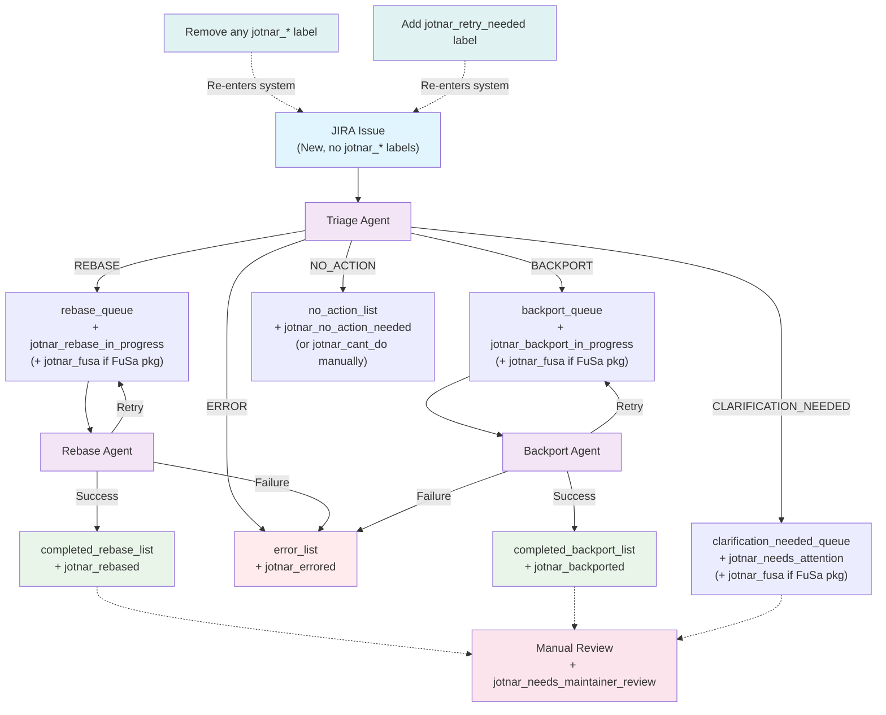

# Merge Request Workflow

A set of AI agents implemented in the BeeAI Framework, interconnected via Redis.
Every agent can run individually or pick up tasks from a Redis queue.

See [README.md](README.md) for general notes about setting up the development environment.

## Architecture

Three agents process tasks through Redis queues:
- **Triage Agent**: Analyzes JIRA issues and determines resolution path. It uses title, description, fields, and comments to find out root cause of the issue. It can ask for clarification, create tasks for other agents or may take no action if not needed.
- **Rebase Agent**: Updates packages to newer upstream versions. A Rebase is only to be chosen when the issue explicitly instructs you to "rebase" or "update". It looks for upstream references that are linked, attached and present in the description or comments in the issue.
- **Backport Agent**: Applies specific fixes/patches to packages. It looks for patches that are linked, attached and present in the description or comments in the issue. It tries to apply the patch and resolve any conflicts that may arise during the backport process.

### Entry Criteria

Issues enter the system automatically via the Jira Issue Fetcher when they meet these criteria:
- `jotnar-project` is assignee of the issue
- No `jotnar_*` labels other than `jotnar_retry_needed`

### Queue Transitions and Label Management

The system uses Redis queues to route issues between agents and applies JIRA labels to track progress:

**From Triage Agent:**
- **REBASE decision** → `rebase_queue` + applies `jotnar_rebase_in_progress` label
- **BACKPORT decision** → `backport_queue` + applies `jotnar_backport_in_progress` label
- **CLARIFICATION_NEEDED decision** → `clarification_needed_queue` + applies `jotnar_needs_attention` label
- **NO_ACTION decision** → `no_action_list` + applies `jotnar_no_action_needed` label (jötnar team members may apply `jotnar_cant_do` if the system cannot solve the problem)
- **ERROR/Exception** → `error_list` + applies `jotnar_errored` label
- **Max retries exceeded** → `error_list` + applies `jotnar_errored` label

**From Rebase Agent:**
- **Success** → `completed_rebase_list` + applies `jotnar_rebased` label
- **Failure** → `error_list` + applies `jotnar_errored` label
- **Retry** → remains in `rebase_queue` (keeps `jotnar_rebase|backport_in_progress` label)

**From Backport Agent:**
- **Success** → `completed_backport_list` + applies `jotnar_backported` label
- **Failure** → `error_list` + applies `jotnar_errored` label
- **Retry** → remains in `backport_queue` (keeps `jotnar_rebase|backport_in_progress` label)

#### Re-triggering Mechanism

Issues can be re-triggered through the workflow in two ways:
1. **Remove any existing `jotnar_*` label** - allows the issue to re-enter the system on the next fetcher run
2. **Add the `jotnar_retry_needed` label** - triggers workflow retry. Use cases include:
   - Package maintainers who have made changes (e.g., updated some fields, added links, commented)
   - Jötnar team members after production code updates to resolve issues

#### Maintainer Review Process

Some Jira issues will require a maintainer review by applying the `jotnar_needs_maintainer_review` label to an issue. This is currently agreed on for FuSa (Functional Safety) project packages.

The `jotnar_fusa` label will be automatically added by the triage agent to JIRA issues involving FuSa packages, and related merge requests will need to be reviewed and handled by subject matter experts.

#### Workflow Diagram



## Setup

- Copy the `templates` directory to `.secrets` and fill in required information.
    - For `.secrets/rhel-config.json`, you can also copy the content from [jotnar](https://github.com/packit/jotnar) repo

## Running as a service

The agents run continuously, waiting for work from Redis queues. To process a JIRA issue:

**Step 1: Start the system** (if not already running)
```bash
make start
```

This runs the services in the foreground, showing logs for monitoring and debugging. If you prefer to run the services in the background, use `make start-detached` instead.

**Step 2: Trigger work**
```bash
make trigger-pipeline JIRA_ISSUE=RHEL-12345
```

## Running individual agents

You can run any agent individually with the appropriate make target, passing required input data via environment variables, e.g. `make JIRA_ISSUE=RHEL-12345 run-triage-agent-standalone`.
The agent will run only once, print its output and exit.

```bash
make JIRA_ISSUE=RHEL-12345 run-triage-agent-standalone
make PACKAGE=httpd VERSION=2.4.62 JIRA_ISSUE=RHEL-12345 BRANCH=c10s run-rebase-agent-standalone
make PACKAGE=httpd UPSTREAM_FIX=https://github.com/... JIRA_ISSUE=RHEL-12345 BRANCH=c10s run-backport-agent-standalone
```

## Jira Issue Fetcher

The Jira Issue Fetcher automatically fetches issues from Jira and adds them to the triage queue. It runs as a standalone service.

**Setup:**
```bash
# Copy the environment template
cp templates/jira-issue-fetcher.env .secrets/jira-issue-fetcher.env

# Edit with your credentials
vim .secrets/jira-issue-fetcher.env
```

**Running:**
```bash
# Build the issue fetcher image
make build-jira-issue-fetcher

# Run the fetcher once (includes validation checks)
make run-jira-issue-fetcher

# View logs if running in background
make logs-jira-issue-fetcher
```

The fetcher will automatically fetch issues based on the configured JQL query and push them to the triage queue for processing.

## Dry-Run mode

Both backport and rebase agents support **dry-run mode** for testing workflows without actually pushing changes or creating merge requests. By default, agents run in **production mode** and will create actual commits, pushes, and merge requests.

To enable dry-run mode for testing, set the `DRY_RUN=true` environment variable.
